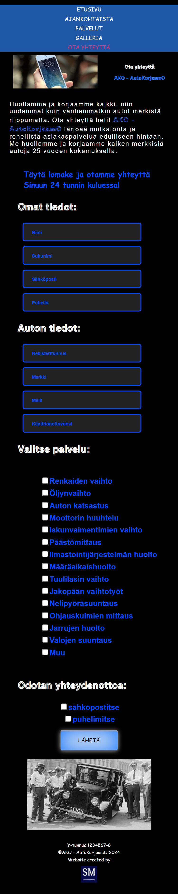

# Module. Project "React Responsive Website for an Сar repair shop"
This is a fictional responsive website for an сar repair shop created using React. 
Initially, it was developed as a final project for the "Basics of html & css" course (Southeastern Finland University of Applied Sciences, Hops external studies/Kaakkois-Suomen ammattikorkeakoulu, Hopsin ulkopuoliset opinnot) using only HTML and CSS. 
After learning React, it was converted to React for practice.
Developed as a practical task.

---

## Technologies

* React
* HTML
* CSS

---

## Features

* Responsive design
* User-friendly interface
* Basic functionality for an autoshop website

---

## Installation. Instructions for setting up the project locally: 

* Clone the repository.
* Navigate to the project directory.
* Install the dependencies using npm install.
* Start the development server with npm start.

---

Finnish language

---

## Author
SofMik, student web developer

---

## Screenshot

